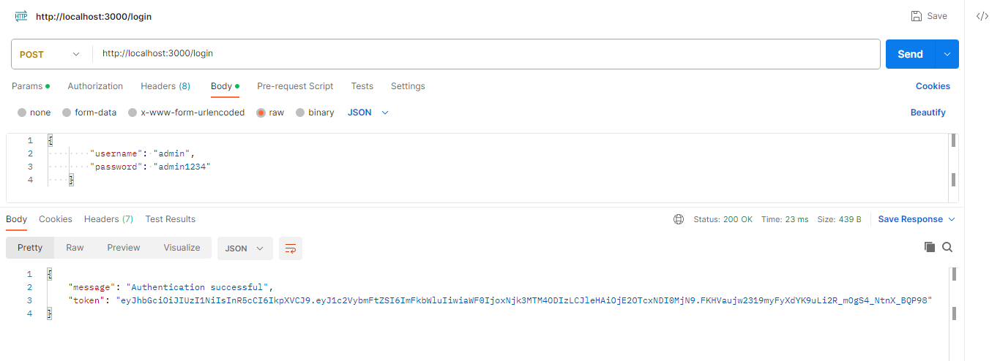
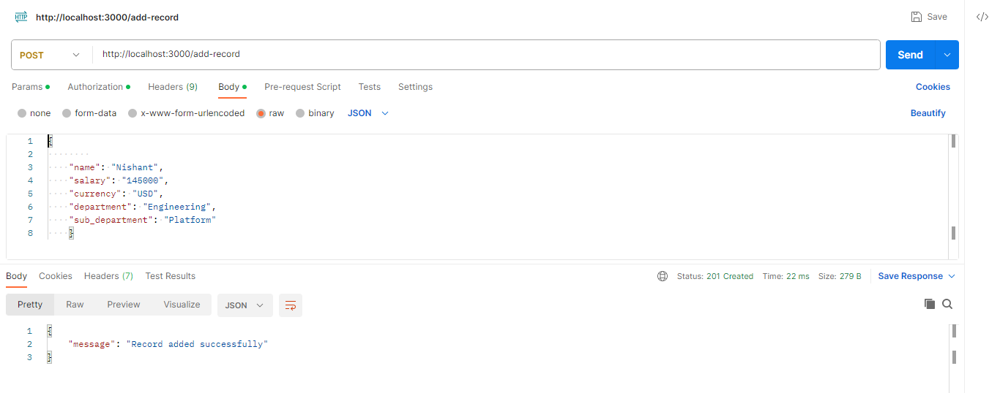
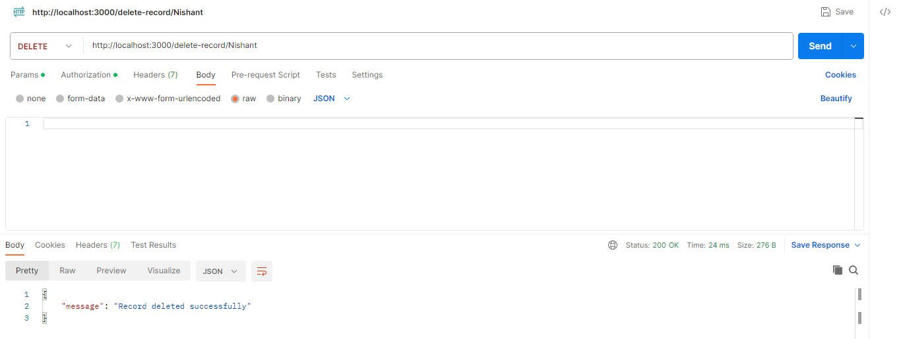
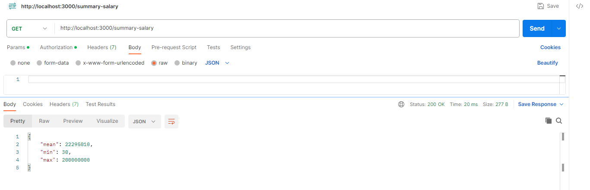
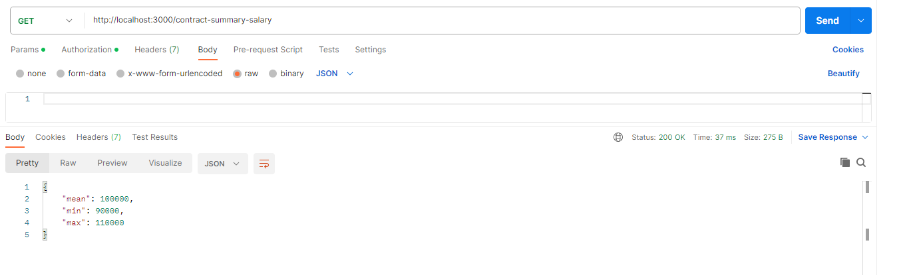
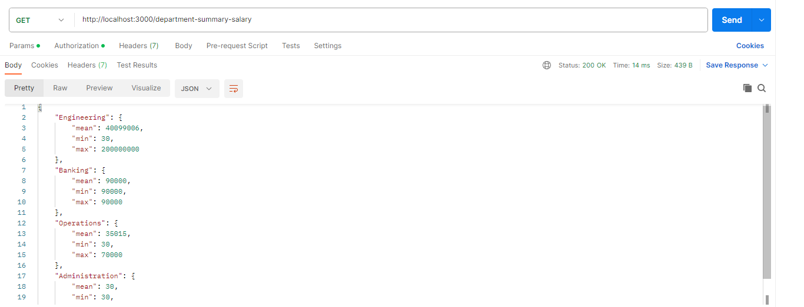
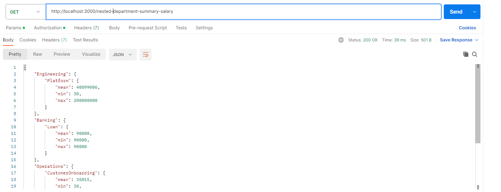
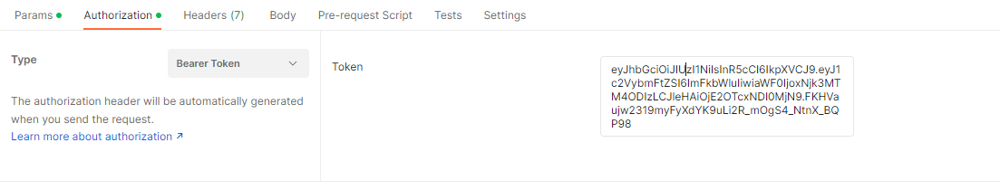

# Summary Salary Dataset

Brief project description and what it does.

## Table of Contents

- [Getting Started](#getting-started)
  - [Prerequisites](#prerequisites)
  - [Installation](#installation)
- [API Endpoints](#api-endpoints)
- [Authentication](#authentication)
- [Dataset](#dataset)


## Getting Started

Explain how to set up and run your project locally. Provide step-by-step instructions.

### Prerequisites

Software Used are-
1. NodeJS
2. Express
3. Postman
4. Javascript

### Installation

A step-by-step guide on how to install and configure your project. Use code blocks to provide commands or configuration examples.

```bash
# Clone the repository
git clone https://github.com/NishantSinghal19/Dataset.git

# Change directory
cd Dataset

# Install dependencies
npm install
```

## API EndPoints

Here I am explaining all the APIs that have been created and how to use them
1. 'POST /login': Here it requires a body in JSON format which needs a username and password and will generate the required token in authorization.

**SS - Summary Statistics** It essentially means 3 values (mean, min, max)
Now all these APIs require an authentication token
2. 'POST /add-record': It is used to add a record in the dataset

3. 'DELETE /delete-record': It is used to delete the record from the data set.

4. 'GET /summary-salary': It is used to fetch SS for salary over the entire dataset

5. 'GET /contract-summary-salary': It is used to fetch SS for salary for records which satisfy "on_contract": "true"

6. 'GET /department-summary-salary': It is used to fetch SS for salary for each department.

7. 'GET /nested-department-summary-salary': It is used to fetch SS for the salary for each department and sub-department combination

## Authentication 

It is done using the Bearer token generated while login

## Dataset

A provided dataset is used here and data is stored in the form of JSON there we can read, write ,update and delete the data.
